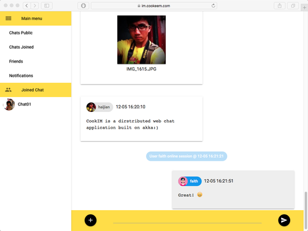
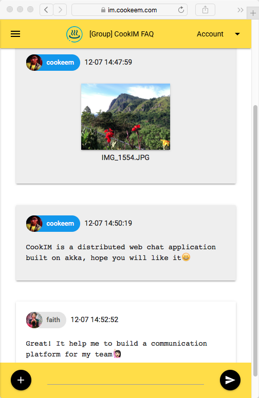
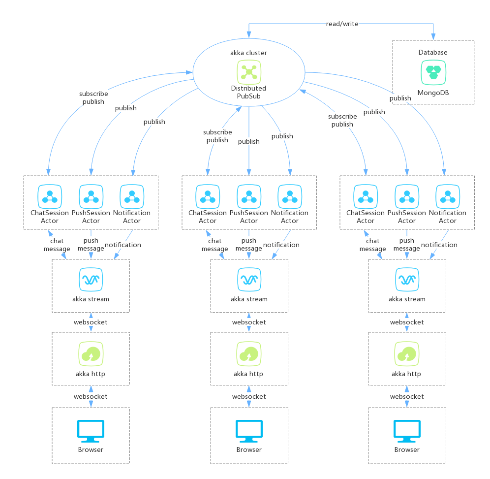
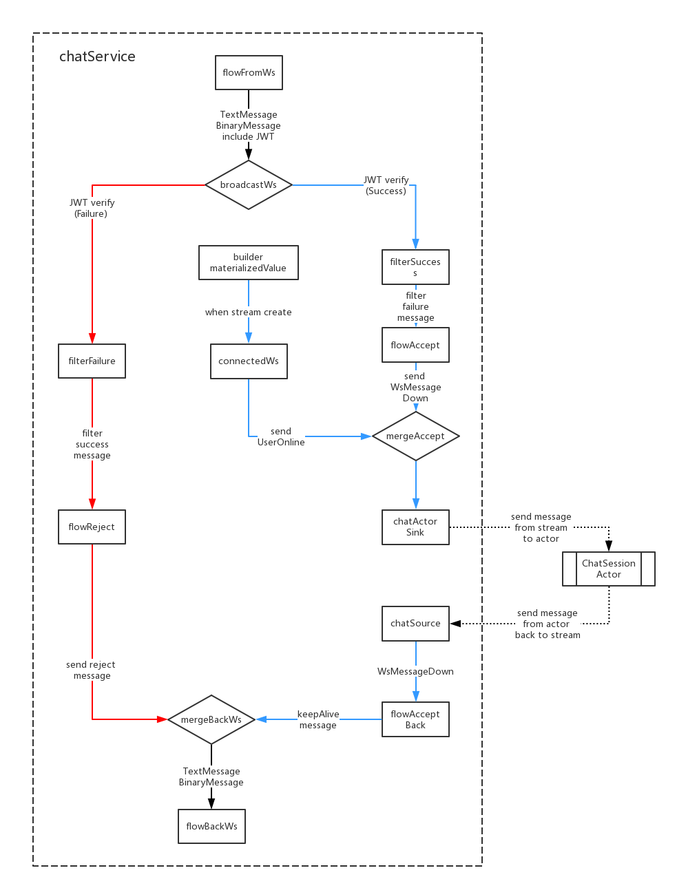

# CookIM - is a distributed websocket chat applications based on akka


- [中文文档](README_CN.md)
- [English document](README.md)

---

- [GitHub project](https://github.com/cookeem/CookIM/)

---

### Category

1. [Demo](#demo)
    1. [Demo on PC](#demo-on-pc)
    1. [Demo on Mobile](#demo-on-mobile)
    1. [Demo link](#demo-link)
1. [Start single node CookIM in docker](#start-single-node-cookim-in-docker)
    1. [Get docker image](#get-docker-image)
    1. [Run docker](#run-docker)
    1. [Debug docker](#debug-docker)
    1. [Stop docker](#stop-docker)
1. [Start multiple nodes CookIM in docker compose](#start-multiple-nodes-cookim-in-docker-compose)
    1. [Start docker compose](#start-docker-compose)
    1. [Add nodes in docker compose](#add-nodes-in-docker-compose)
    1. [Stop docker compose](#stop-docker-compose)
1. [Manual install prerequisites](#manual-install-prerequisites)
    1. [Install Java 8+](#install-java-8)
    1. [Install Scala 2.11+](#install-scala-211)
    1. [Install SBT 0.13+](#install-sbt-013)
    1. [Install MongoDB 3+](#install-mongodb-3)
1. [How to run](#how-to-run)
    1. [Clone source code](#clone-source-code)
    1. [Start MongoDB server](#start-mongodb-server)
    1. [Download SBT dependencies](#download-sbt-dependencies)
    1. [Use prepared jar libs to run CookIM](#use-prepared-jar-libs-to-run-cookim)
    1. [Start CookIM server](#start-cookim-server)
    1. [Open browser and access web port 8080](#open-browser-and-access-web-port-8080)
    1. [Start another CookIM server](#start-another-cookim-server)
    1. [Open browser and access web port 8081](#open-browser-and-access-web-port-8081)
1. [Architecture](#architecture)
    1. [Architecture picture](#architecture-picture)
    1. [akka stream websocket graph](#akka-stream-websocket-graph)
    1. [MongoDB tables specification](#mongodb-tables-specification)
    1. [Websocket message type](#websocket-message-type)

---
[Category](#category)

###Demo

#### Demo on PC

 

#### Demo on Mobile




#### Demo link
[https://im.cookeem.com](https://im.cookeem.com)

---
    
### Start single node CookIM in docker
  
---

#### Get docker image

```sh
$ sudo docker pull cookeem/cookim
```
---
[Category](#category)

#### Run docker

```sh
$ sudo docker run -d -p 8080:8080 cookeem/cookim
```

Browser to access:
> http://localhost:8080

If use want to modify HTTP port to 18080, just use the command below:
```sh
$ sudo docker run -d -p 18080:8080 cookeem/cookim
```

---

[Category](#category)

#### Debug docker

Run command below to obtain container ID
```
$ sudo docker ps
       CONTAINER ID        IMAGE               COMMAND                  CREATED             STATUS              PORTS                    NAMES
       9c353289cf37        cookeem/cookim      "/root/cookim/entry.s"   4 seconds ago       Up 2 seconds        0.0.0.0:8080->8080/tcp   stoic_borg
```

Run command below to debug container
```sh
$ sudo docker exec -ti #CONTAINER ID# /bin/bash
```

---

[Category](#category)

#### Stop docker

Run command below to stop container and remove container already exited
```sh
$ sudo docker stop #CONTAINER ID#
$ sudo docker rm #CONTAINER ID#
```

---

[Category](#category)

### Start multiple nodes CookIM in docker compose

#### Start docker compose

Change into CookIM directory, run command below, start multiple nodes CookIM servers in docker compose mode. This way will start 3 container: mongodb, cookim1 and cookim2
```sh
$ sudo docker-compose up -d
Creating docker_mongodb_1
Creating docker_cookim1_1
Creating docker_cookim2_1
```

After run docker compose, use different browser to access the URLs below to connect to cookim1 and cookim2
> http://localhost:8080
> http://localhost:8081

---

[Category](#category)

#### Add nodes in docker compose

You can add config in ```docker-compose.yml``` (in CookIM directory) to add CookIM server nodes, this example show how to add cookim3 in docker compose: 
```yaml
      cookim3:
        image: cookeem/cookim-cluster
        volumes:
         - /tmp:/root/cookim/upload
        environment:
          HOST_NAME: "cookim3"
          WEB_PORT: "8080"
          AKKA_PORT: "2551"
          SEED_NODES: "cookim1:2551"
        ports:
         - "8082:8080"
        depends_on:
         - mongodb
         - cookim1
```
---

[Category](#category)

#### Stop docker compose
```sh
$ sudo docker-compose stop
$ sudo docker-compose rm
```
---

[Category](#category)

### Manual install prerequisites

---

[Category](#category)

#### Install Java 8+

Download JDK8 binary, download URL is here:
```sh
http://www.oracle.com/technetwork/java/javase/downloads/index.html
```

Download binary file, the URL like this:
```sh
$ wget http://download.oracle.com/otn-pub/java/jdk/8u111-b14/jdk-8u111-linux-x64.tar.gz
```

Extract the compressed file in any directory you want:
```sh
$ tar zxvf jdk-8u111-linux-x64.tar.gz
```

Config the environment path variable, add config below at the end of /etc/profile:
```sh
$ sudo vi /etc/profile
export JAVA_HOME=<Your java binary directory>
export CLASSPATH=$JAVA_HOME/lib/tools.jar
export PATH=$JAVA_HOME/bin:$PATH
```

Open a new terminal to make environment variable available, run command below to check install correct or not:
```sh
$ java -version
java version "1.8.0_65"
Java(TM) SE Runtime Environment (build 1.8.0_65-b17)
Java HotSpot(TM) 64-Bit Server VM (build 25.65-b01, mixed mode)
```

---

[Category](#category)

#### Install Scala 2.11+

Download Scala 2.11 binary, download URL is here:
```sh
http://scala-lang.org/download/all.html
```

Download binary file, the URL like this:

```sh
$ wget http://downloads.lightbend.com/scala/2.11.8/scala-2.11.8.tgz
```

Extract the compressed file in any directory you want:
```sh
$ tar zxvf scala-2.11.8.tgz
```

Config the environment path variable, add config below at the end of /etc/profile:
```sh
$ sudo vi /etc/profile
export SCALA_HOME=<Your scala binary directory>
export PATH=$PATH:$SCALA_HOME/bin
```

Open a new terminal to make environment variable available, run command below to check install correct or not:
```sh
$ scala
  Welcome to Scala 2.11.8 (Java HotSpot(TM) 64-Bit Server VM, Java 1.8.0_65).
  Type in expressions for evaluation. Or try :help.
  
  scala> 
```

---

[Category](#category)

#### Install SBT 0.13+

Download SBT 0.13.13 binary, download URL is here:
```sh
http://www.scala-sbt.org/download.html
```

Download binary file, the URL like this:
```sh
$ wget https://dl.bintray.com/sbt/native-packages/sbt/0.13.13/sbt-0.13.13.tgz
```

Extract the compressed file in any directory you want:
```sh
$ tar zxvf sbt-0.13.13.tgz
```

Config the environment path variable, add config below at the end of /etc/profile:
```sh
$ sudo vi /etc/profile
export SBT_HOME=<Your sbt binary directory>
export PATH=$PATH:SBT_HOME/bin
```

Open a new terminal to make environment variable available, run command below to check install correct or not:
```sh
$ sbt
[info] Set current project to cookeem (in build file:/Users/cookeem/)

```
---

[Category](#category)

#### Install MongoDB 3+

Download MongoDB 3+ binary, download URL is here:
```sh
https://www.mongodb.com/download-center?jmp=nav#community
```

> Notice: 3.4.x MongoDB has unfixed bug in CookIM, please do not use this version, we recommend to use 3.2.11

Download binary file, the URL like this:

```sh
$ wget https://fastdl.mongodb.org/linux/mongodb-linux-x86_64-amazon-3.2.9.tgz
```

Extract the compressed file in any directory you want:
```sh
$ tar zxvf mongodb-linux-x86_64-amazon-3.2.9.tgz
```

Config the environment path variable, add config below at the end of /etc/profile:
```sh
$ sudo vi /etc/profile
export MONGODB_HOME=<Your mongoDB binary directory>
export PATH=$PATH:MONGODB_HOME/bin
```

Create mongodb database file directory, mongodb use /data/db as default  database file directory 
```sh
$ sudo mkdir -p /data/db
```

Open a new terminal to make environment variable available, run command below to check install correct or not.

By default mongodb listen port 27017
```sh
$ mongod
2016-12-06T17:24:06.268+0800 I CONTROL  [initandlisten] MongoDB starting : pid=2854 port=27017 dbpath=/data/db 64-bit host=cookeemMac.local
2016-12-06T17:24:06.268+0800 I CONTROL  [initandlisten] db version v3.2.9
2016-12-06T17:24:06.268+0800 I CONTROL  [initandlisten] git version: 22ec9e93b40c85fc7cae7d56e7d6a02fd811088c
2016-12-06T17:24:06.269+0800 I CONTROL  [initandlisten] OpenSSL version: OpenSSL 0.9.8zh 14 Jan 2016
2016-12-06T17:24:06.269+0800 I CONTROL  [initandlisten] allocator: system
2016-12-06T17:24:06.269+0800 I CONTROL  [initandlisten] modules: none
2016-12-06T17:24:06.269+0800 I CONTROL  [initandlisten] build environment:
2016-12-06T17:24:06.269+0800 I CONTROL  [initandlisten]     distarch: x86_64
2016-12-06T17:24:06.269+0800 I CONTROL  [initandlisten]     target_arch: x86_64
2016-12-06T17:24:06.269+0800 I CONTROL  [initandlisten] options: {}
2016-12-06T17:24:06.270+0800 I -        [initandlisten] Detected data files in /data/db created by the 'wiredTiger' storage engine, so setting the active storage engine to 'wiredTiger'.
2016-12-06T17:24:06.270+0800 I STORAGE  [initandlisten] wiredtiger_open config: create,cache_size=9G,session_max=20000,eviction=(threads_max=4),config_base=false,statistics=(fast),log=(enabled=true,archive=true,path=journal,compressor=snappy),file_manager=(close_idle_time=100000),checkpoint=(wait=60,log_size=2GB),statistics_log=(wait=0),
2016-12-06T17:24:07.639+0800 I CONTROL  [initandlisten] 
2016-12-06T17:24:07.639+0800 I CONTROL  [initandlisten] ** WARNING: soft rlimits too low. Number of files is 256, should be at least 1000
2016-12-06T17:24:07.701+0800 I NETWORK  [HostnameCanonicalizationWorker] Starting hostname canonicalization worker
2016-12-06T17:24:07.701+0800 I FTDC     [initandlisten] Initializing full-time diagnostic data capture with directory '/data/db/diagnostic.data'
2016-12-06T17:24:07.737+0800 I NETWORK  [initandlisten] waiting for connections on port 27017
```
---

[Category](#category)


### How to run

#### Clone source code
```sh
git clone https://github.com/cookeem/CookIM.git

cd CookIM
```
---

[Category](#category)

#### Start MongoDB server

```sh
$ mongod &
```
---

[Category](#category)

#### Download SBT dependencies

Open another terminal, back to CookIM directory, run command below to download sbt dependencies, this will spend couples minutes

```sh
$ cd ..
$ sbt console
```
---

[Category](#category)

#### Use prepared jar libs to run CookIM

If use sbt to download dependencies is too slow, you can use the dependencies we prepared for you locate in ```libs``` directory

---

[Category](#category)

#### Start CookIM server

There are two ways to start CookIM server: sbt and java

a. sbt way: change to CookIM directory, use sbt and sbt dependcies to start CookIM server:
```sh
$ cd #CookIM directory#

$ sbt "run-main com.cookeem.chat.CookIM -h localhost -w 8080 -a 2551 -s localhost:2551"
```
b. java way: change to CookIM directory, use java and prepared jar libs to start CookIM server:
```sh
$ cd #CookIM directory#

$ java -classpath "libs/*" com.cookeem.chat.CookIM -h localhost -w 8080 -a 2551 -s localhost:2551
```

Command above has start a web server listen port 8080 and akka system listen port 2551

Parameters:

 -a,--akka-port <AKKA-PORT>     akka cluster node port
 
 -h,--host-name <HOST-NAME>     current web service external host name
 
 -n,--nat                       is nat network or in docker(docker mode must set)
 
 -s,--seed-nodes <SEED-NODES>   akka cluster seed nodes, seperate with comma, example:
 
                                localhost:2551,localhost:2552

---

[Category](#category)

#### Open browser and access web port 8080
> http://localhost:8080

---

[Category](#category)

#### Start another CookIM server

Open another terminal, start another CookIM server to test message communication between servers:

a. sbt way: change to CookIM directory, use sbt and sbt dependcies to start CookIM server:
```sh
$ cd #CookIM directory#

$ sbt "run-main com.cookeem.chat.CookIM -h localhost -w 8081 -a 2552 -s localhost:2551"
```
b. java way: change to CookIM directory, use java and prepared jar libs to start CookIM server:
```sh
$ cd #CookIM directory#

$ java -classpath "libs/*" com.cookeem.chat.CookIM -h localhost -w 8081 -a 2552 -s localhost:2551
```

Command above has start a web server listen port 8081 and akka system listen port 2552

---

[Category](#category)

#### Open browser and access web port 8081
> http://localhost:8081

---

[Category](#category)

### Architecture

#### Architecture picture



**CookIM server make from 3 parts: **

> 1. akka http: provide web service, browser connect distributed chat servers by websocket

> 2. akka stream: akka http receive websocket message (websocket message include TextMessage and BinaryMessage), then send message to chatService by akka stream way, websocket message include JWT(Javascript web token), if JWT verify failure, chatService stream will return reject message; if JWT verify success, chatService stream will send message to ChatSessionActor

> 3. akka cluster：akka stream send websocket message to akka cluster ChatSessionActor, ChatSessionActor use DistributedPubSub to subscribe and publish message in akka cluster. When user online session, it will subscribe the session; when user send message in session, it will publish message in akka cluster, the actors who subscribe the session will receive the publish message

---

[Category](#category)

#### akka stream websocket graph



 - When akka http receive messsage from websocket, it will send message to chatService flow, here we use akka stream graph:

> 1. Websocket message body include JWT, flowFromWS use to receive websocket message and decode JWT;

> 2. When JWT verify failure, it will broadcast to filterFailure to filter to fail message; When JWT verify success, it will broadcast to filterSuccess to filter to success message;

> 3. When akka stream created, builder.materializedValue will send message to connectedWs, connectedWs convert message receive to UserOnline message, then send to chatSinkActor finally send to ChatSessionActor; 

> 4. chatActorSink send message to chatSessionActor, when akka stream closed if will send UserOffline message to down stream;

> 5. chatSource receive message back from ChatSessionActor, then send message back to flowAcceptBack;

> 6. flowAcceptBack will let the websocket connection keepAlive;

> 7. flowReject and flowAcceptBack messages finally send to flowBackWs, flowBackWs convert messages to websocket format then send back to users;

---

[Category](#category)

#### MongoDB tables specification

 - users: users table
```
*login (login email)
nickname (nickname)
password (password SHA1)
gender (gender: unknow:0, boy:1, girl:2)
avatar (avatar abs path, example: /upload/avatar/201610/26/xxxx.JPG)
lastLogin (last login timestamp)
loginCount (login counts)
sessionsStatus (user joined sessions status)
    [{sessionid: session id, newCount: unread message count in this session}]
friends (user's friends list: [friends uid])
dateline (register timestamp)
```

 - sessions: sessions table
```
*createuid (creator uid)
*ouid (receiver uid, when session type is private available)
sessionIcon (session icon, when session type is group available)
sessionType (session type: 0:private, 1:group)
publicType (public type: 0:not public, 1:public)
sessionName (session name)
dateline (created timestamp)
usersStatus (users who joined this session status)
    [{uid: uid, online: (true, false)}]
lastMsgid (last message id)
lastUpdate (last update timestamp)
```
 - messages: messages tables
```
*uid (send user uid)
*sessionid (relative session id)
msgType (message type)
content (message content)
fileInfo (file information)
    {
        filePath
        fileName
        fileType
        fileSize
        fileThumb
    }
*dateline (created timestamp)
```

 - onlines: online users table
```
*uid (online user id)
dateline (last update timestamp)
```

 - notifications: receive notifications table
```
noticeType (notification type: "joinFriend", "removeFriend", "inviteSession")
senduid (send user id)
*recvuid (receive user id)
sessionid (relative session id)
isRead (notification is read: 0:not read, 1:already read)
dateline (created timestamp)
```

---

[Category](#category)

#### Websocket message type

There are two websocket channel: ws-push and ws-chat

> ws-push send sessions new message to users, when user not online the session, they still can receive which sessions has new messages

/ws-push channel
```
up message, use to subscribe push message:
{ userToken: "xxx" }

down message:
acceptMsg:     { uid: "xxx", nickname: "xxx", avatar: "xxx", sessionid: "xxx", sessionName: "xxx", sessionIcon: "xxx", msgType: "accept", content: "xxx", dateline: "xxx" }
rejectMsg:     { uid: "", nickname: "", avatar: "", sessionid: "", sessionName: "", sessionIcon: "", msgType: "reject", content: "xxx", dateline: "xxx" }
keepAlive:     { uid: "", nickname: "", avatar: "", sessionid: "", sessionName: "", sessionIcon: "", msgType: "keepalive", content: "", dateline: "xxx" }
textMsg:       { uid: "xxx", nickname: "xxx", avatar: "xxx", sessionid: "xxx", sessionName: "xxx", sessionIcon: "xxx", msgType: "text", content: "xxx", dateline: "xxx" }
fileMsg:       { uid: "xxx", nickname: "xxx", avatar: "xxx", sessionid: "xxx", sessionName: "xxx", sessionIcon: "xxx", msgType: "file", fileName: "xxx", fileType: "xxx", fileid: "xxx", thumbid: "xxx", dateline: "xxx" }
onlineMsg:     { uid: "xxx", nickname: "xxx", avatar: "xxx", sessionid: "xxx", sessionName: "xxx", sessionIcon: "xxx", msgType: "online", content: "xxx", dateline: "xxx" }
offlineMsg:    { uid: "xxx", nickname: "xxx", avatar: "xxx", sessionid: "xxx", sessionName: "xxx", sessionIcon: "xxx", msgType: "offline", content: "xxx", dateline: "xxx" }
joinSessionMsg: { uid: "xxx", nickname: "xxx", avatar: "xxx", sessionid: "xxx", sessionName: "xxx", sessionIcon: "xxx", msgType: "join", content: "xxx", dateline: "xxx" }
leaveSessionMsg:{ uid: "xxx", nickname: "xxx", avatar: "xxx", sessionid: "xxx", sessionName: "xxx", sessionIcon: "xxx", msgType: "leave", content: "xxx", dateline: "xxx" }
noticeMsg:     { uid: "", nickname: "", avatar: "", sessionid: "", sessionName: "xxx", sessionIcon: "xxx", msgType: "system", content: "xxx", dateline: "xxx" }

message push to browser:
pushMsg:       { 
                    uid: "xxx", nickname: "xxx", avatar: "xxx", sessionid: "xxx", sessionName: "xxx", sessionIcon: "xxx", msgType: "xxx", 
                    content: "xxx", fileName: "xxx", fileType: "xxx", fileid: "xxx", thumbid: "xxx",
                    dateline: "xxx" 
               }
```

---

[Category](#category)

> ws-chat is session chat channel, user send and receive session messages in this channel

```
/ws-chat channel
up message: 
onlineMsg:     { userToken: "xxx", sessionToken: "xxx", msgType:"online", content:"" }
textMsg:       { userToken: "xxx", sessionToken: "xxx", msgType:"text", content:"xxx" }
fileMsg:       { userToken: "xxx", sessionToken: "xxx", msgType:"file", fileName:"xxx", fileSize: 999, fileType: "xxx" }<#BinaryInfo#>binary_file_array_buffer

down message:   
rejectMsg:     { uid: "", nickname: "", avatar: "", sessionid: "", sessionName: "", sessionIcon: "", msgType: "reject", content: "xxx", dateline: "xxx" }
keepAlive:     { uid: "", nickname: "", avatar: "", sessionid: "", sessionName: "", sessionIcon: "", msgType: "keepalive", content: "", dateline: "xxx" }
textMsg:       { uid: "xxx", nickname: "xxx", avatar: "xxx", sessionid: "xxx", sessionName: "xxx", sessionIcon: "xxx", msgType: "text", content: "xxx", dateline: "xxx" }
fileMsg:       { uid: "xxx", nickname: "xxx", avatar: "xxx", sessionid: "xxx", sessionName: "xxx", sessionIcon: "xxx", msgType: "file", fileName: "xxx", fileType: "xxx", fileid: "xxx", thumbid: "xxx", dateline: "xxx" }
onlineMsg:     { uid: "xxx", nickname: "xxx", avatar: "xxx", sessionid: "xxx", sessionName: "xxx", sessionIcon: "xxx", msgType: "online", content: "xxx", dateline: "xxx" }
offlineMsg:    { uid: "xxx", nickname: "xxx", avatar: "xxx", sessionid: "xxx", sessionName: "xxx", sessionIcon: "xxx", msgType: "offline", content: "xxx", dateline: "xxx" }
joinSessionMsg:{ uid: "xxx", nickname: "xxx", avatar: "xxx", sessionid: "xxx", sessionName: "xxx", sessionIcon: "xxx", msgType: "join", content: "xxx", dateline: "xxx" }
leaveSessionMsg:{ uid: "xxx", nickname: "xxx", avatar: "xxx", sessionid: "xxx", sessionName: "xxx", sessionIcon: "xxx", msgType: "leave", content: "xxx", dateline: "xxx" }
noticeMsg:     { uid: "", nickname: "", avatar: "", sessionid: "", sessionName: "xxx", sessionIcon: "xxx", msgType: "system", content: "xxx", dateline: "xxx" }

message push to browser:
chatMsg:       { 
                    uid: "xxx", nickname: "xxx", avatar: "xxx", msgType: "xxx", 
                    content: "xxx", fileName: "xxx", fileType: "xxx", fileid: "xxx", thumbid: "xxx",
                    dateline: "xxx" 
               }
```    

---

[Category](#category)

